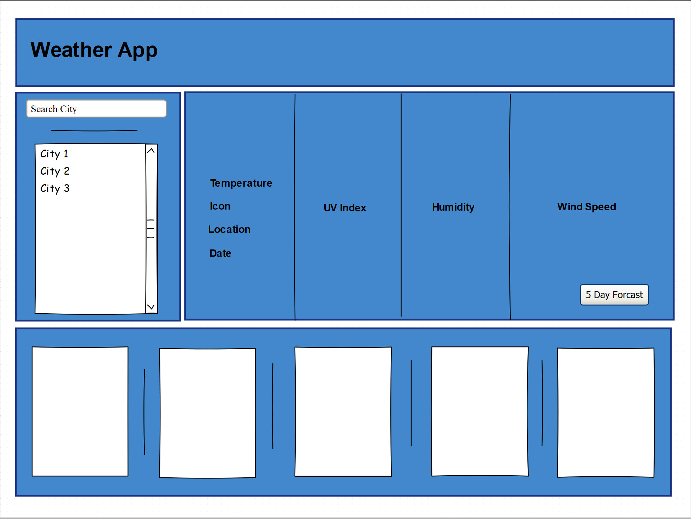
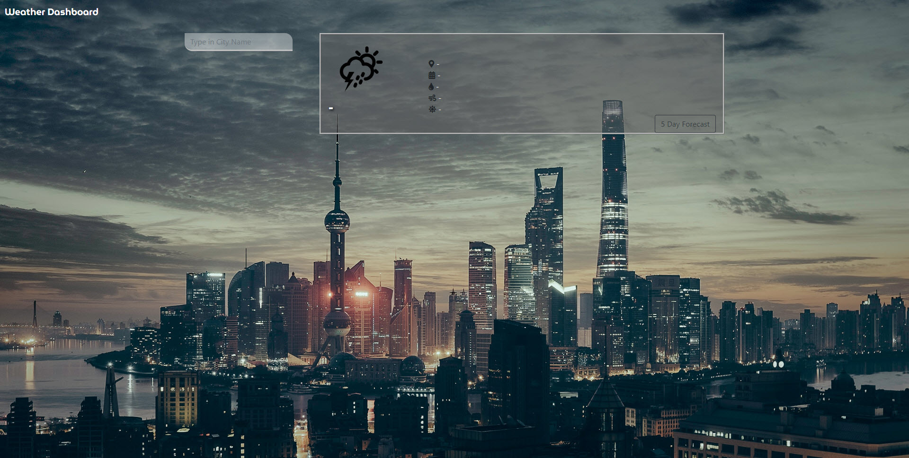
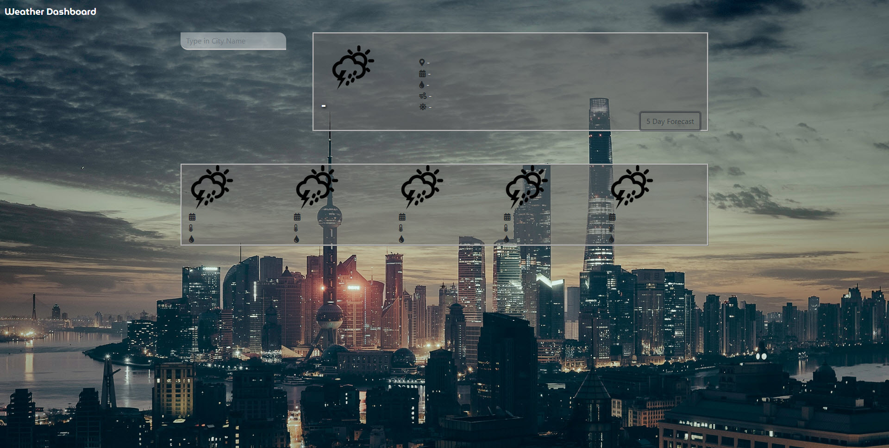
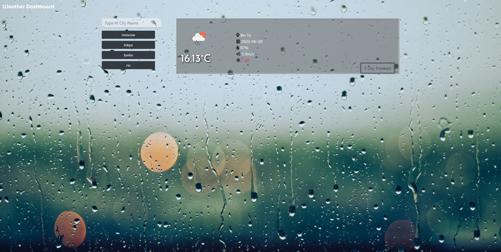
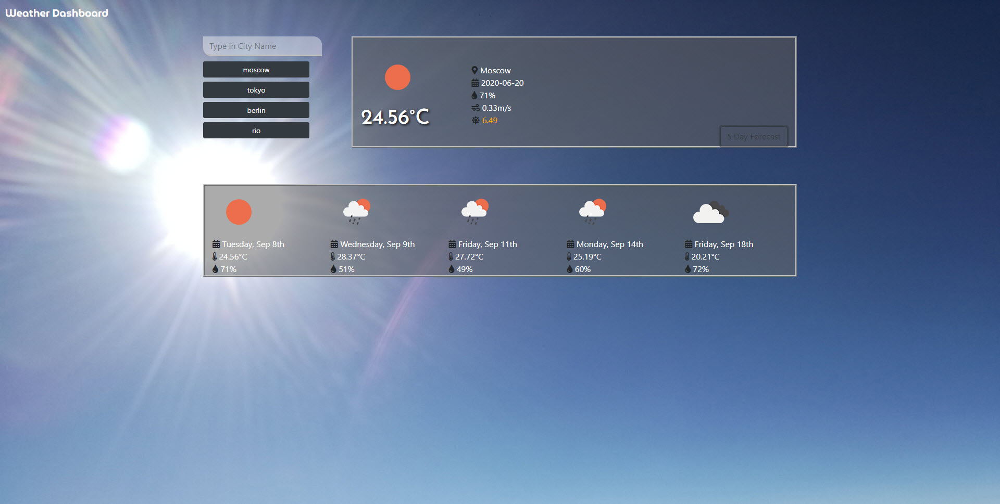
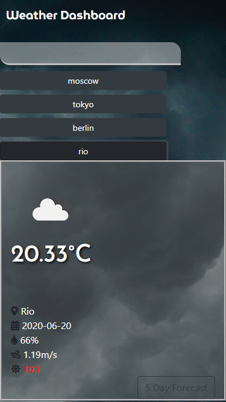

# MBC-Assignment 

## Application & Repository Link

###### [Application Link](https://suji-gith.github.io/MBC-WeatherDashboard/WeatherDashboard.html)

###### [Repository Link](https://github.com/Suji-GitH/MBC-WeatherDashboard)

## Content
- [Overview](#Overview)
- [Acceptance Criteria](#AcceptanceCriteria)
- [UI/UX & Application Screens](#UI/UX&ApplicationScreens)
    - [UI/UX Consideration](#UI/UXConsideration)
    - [App Screenshots](#AppScreenshots)
- [Installation](#Installation) 
- [Credits](#Credits)
- [Testing](#Testing)

## Overview

AS A Globe trotter 
I WANT to see the weather outlook for multiple cities
SO THAT I can plan a trip accordingly

## AcceptanceCriteria

```
GIVEN a weather dashboard with form inputs
WHEN I search for a city
THEN I am presented with current and future conditions for that city and that city is added to the search history
WHEN I view current weather conditions for that city
THEN I am presented with the city name, the date, an icon representation of weather conditions, the temperature, the humidity, the wind speed, and the UV index
WHEN I view the UV index
THEN I am presented with a color that indicates whether the conditions are favorable, moderate, or severe
WHEN I view future weather conditions for that city
THEN I am presented with a 5-day forecast that displays the date, an icon representation of weather conditions, the temperature, and the humidity
WHEN I click on a city in the search history
THEN I am again presented with current and future conditions for that city
WHEN I open the weather dashboard
THEN I am presented with the last searched city forecast
```

## UI/UX&ApplicationScreens

###### UI/UXConsideration

1. Landing Page displays search bar and Weather details panel with placeholders for weather stats to be displayed. 
2. 5 day forecast button is placed in the panel where main weather details are displayed so that User has the choice to see the forecast or not. 
3. Only the 4 recent city searches are displayed under the search bar so there isn't endless amount of cities displayed. 
4. Searched cities are displayed as button which you can click and view the weather details again. 
5. Depending on the weather condition the background will change to match the details.


###### AppScreenshots

initial wire frame for the application layout


Weather App Dashboard - Default State


Weather App Dashboard - 5 Day Forecast Default


Weather App Dashboard - Rendered Weather Details 


Weather App Dashboard - Rendered Weather Details with 5 Day Forecast


Weather App Dashboard - Mobile View <br>


## Installation

Assumption: Application is available to be used by the public.

1. Sign up to https://openweathermap.org/ and generate an API Key.
2. After downloading the application file, navigate to script.js file.  
3. On line 124, paste your API key in between the quotation mark for variable apiKey. 

## Credits

    - Bootstrap
    - Google Fonts
    - Favicon.io 
    - jQuery
    - Moment.js 
    - Font Awesome

## Testing
Only tested for business case scenarios.

As a system, when a wrong city name is entered, alert user to enter valid city name. 

As a User:

- when I land on the landing page, I am presented with search bad, weather panel with default placeholder, and 5 day forecast hidden. 

- when I press the 5 day forecast without having to search for cities, I am presented with 5 day forecast panel with default placeholder. 

- when I search for a city, a button is added with searched city name under the search bar, which is capped at maximum of 4. 

- when I view the weather Condition details, I am presented with city name, the date, an icon representation of weather conditions, the temperature, the humidity, the wind speed, and the UV index.

- when I view the UV index, it is colour coded to indicates weather conditions are favorable(Green), moderate(Orange), or severe(Red).

- when I view the 5 day forecast weather Condition, I am presented with date, an icon representation of weather conditions, the temperature, and the humidity.

- When I click on the city button, I am presented with corresponding weather condition details. 

- When I re-open the weather dashboard, I am presented with last searched city forecast. 
    
